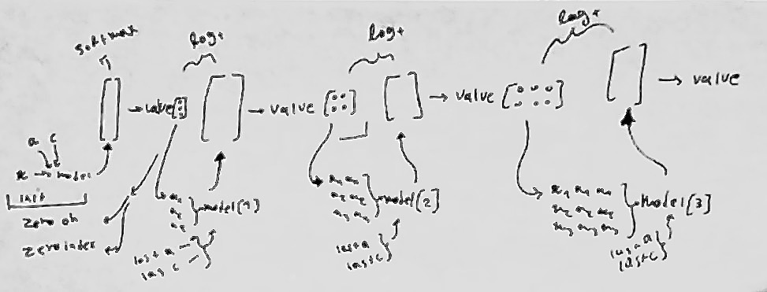
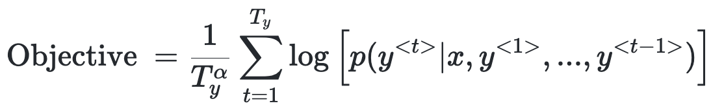
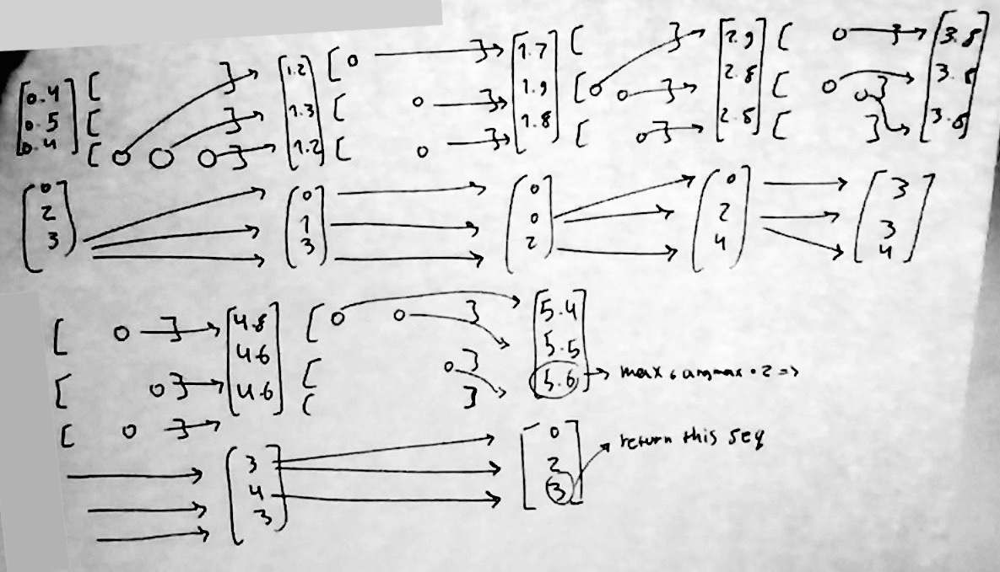

# Beam Search

first what is beam search . imagin you aleady have a trained model on TRM that recommends tasks in a sequence!! thats awesome! but you have two options 1- model can return(recommend) one single next work that is selected py highest probability! but if you choose highest probability in each step, it doesn't garantias us to give highest multiplied probability!! Perhaps you stsrted with low probability task but in sequence you get highest!! so we use probabilistic algorythm called Beam Search!

#### The beam width tips
The beam width B is a parameter for beam search. Large values of B yield to better result but with slower performance and increased memory. Small values of B lead to worse results but is less computationally intensive. A standard value for B is around 10

##### important note : So in general AI team recoomended you to use Sequence Reccomendation with Beam Search
or fisrt calculate Beam Search then just use first recommended task from that sequence

## Beam Search Implimentation

## Beam Search Formula

## for beam_search_test_show()
take a look to this ...

